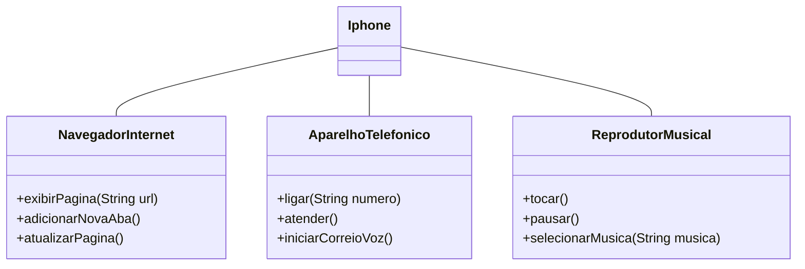

# 📱 Desafio POO: Modelagem do Componente iPhone

Este projeto foi desenvolvido como parte do desafio de Java da DIO, com foco em Programação Orientada a Objetos e Modelagem UML. 
O objetivo é simular as funcionalidades de um iPhone — Reprodutor Musical, Aparelho Telefônico e Navegador de Internet — utilizando interfaces e implementação em Java.

## 🔧 Funcionalidades Implementadas

### 🎵 Reprodutor Musical
- `tocar()`
- `pausar()`
- `selecionarMusica(String musica)`

### 📞 Aparelho Telefônico
- `ligar(String numero)`
- `atender()`
- `iniciarCorreioVoz()`

### 🌐 Navegador na Internet
- `exibirPagina(String url)`
- `adicionarNovaAba()`
- `atualizarPagina()`

> Todas as funcionalidades foram modeladas por meio de **interfaces** e implementadas na classe principal `Iphone`.

## 📁 Estrutura do Projeto

```bash
src/
├── AparelhoTelefonico.java
├── NavegadorInternet.java
├── ReprodutorMusical.java
└── Iphone.java
```

### :bar_chart: Diagrama UML



## 🚀 Autora
Desenvolvido com 💙 por Ilanna Karla, como parte do curso de Java da DIO

✨ Se curtiu o projeto, não esquece de deixar uma ⭐ e acompanhar os próximos desafios
